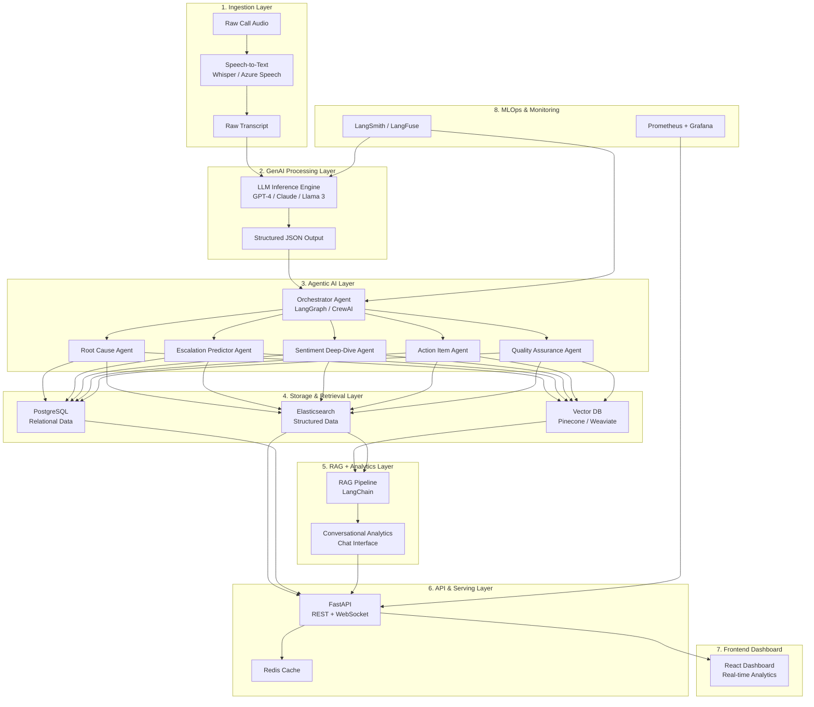
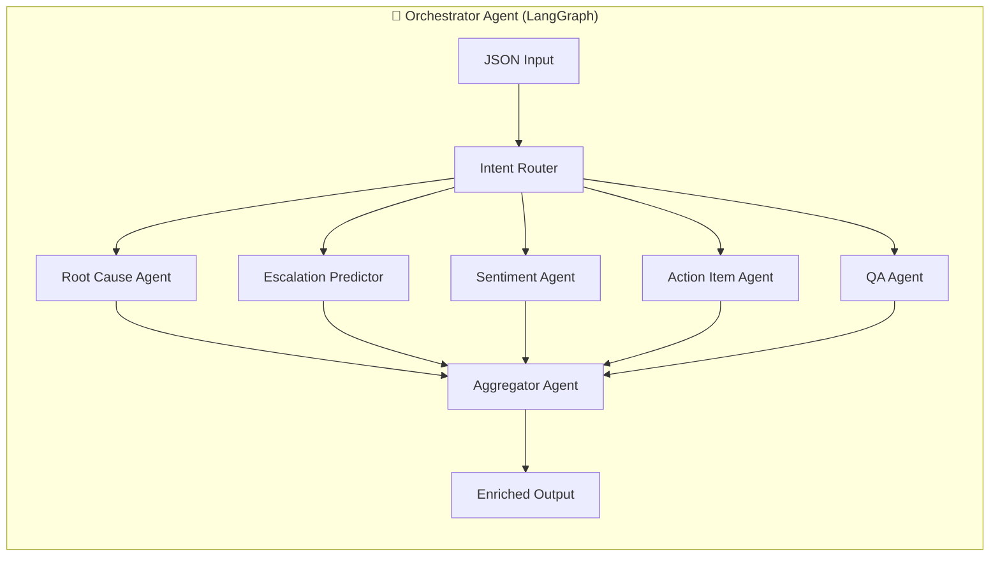
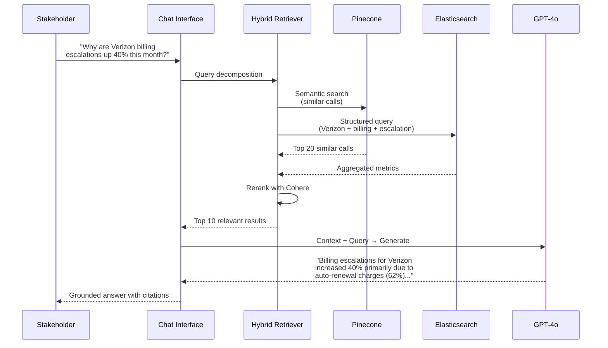
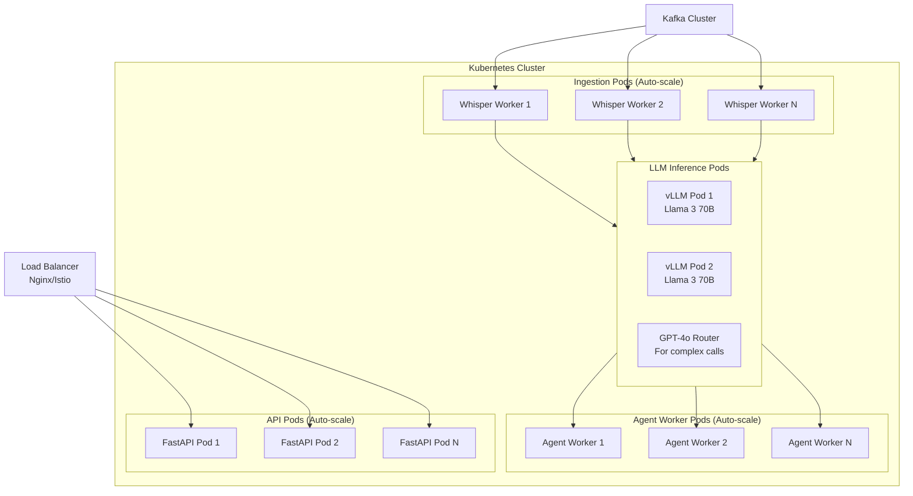

# Customer Interaction Insights — End-to-End GenAI/Agentic AI Architecture

> [!IMPORTANT]
> This document covers the **complete production-grade architecture** from raw call audio → model inference → post-processing → agentic workflows → dashboard — with emphasis on GenAI and Agentic AI at every layer.

---

## 🏗️ High-Level Architecture Overview



---

## 📋 End-to-End Flow — Step by Step

---

### Step 1: Call Ingestion & Speech-to-Text

| Component | Technology | Why |
|-----------|-----------|-----|
| Audio Ingestion | Apache Kafka / AWS S3 Events | Real-time streaming of call recordings |
| Speech-to-Text | OpenAI Whisper (large-v3) | Best accuracy for multi-accent, noisy audio |
| Diarization | PyAnnote Audio | Speaker separation (agent vs customer) |
| Preprocessing | Python (pydub, ffmpeg) | Audio normalization, silence trimming |

**How to explain in interview:**
> "We ingest call recordings in real-time via Kafka topics. Each recording triggers our STT pipeline — we use **OpenAI Whisper large-v3** for transcription because of its superior accuracy with diverse accents. We also run **speaker diarization** using PyAnnote to separate agent and customer speech, which is critical for downstream sentiment analysis per speaker."

---

### Step 2: LLM Inference — Generating the Structured JSON

| Component | Technology | Why |
|-----------|-----------|-----|
| LLM Provider | GPT-4o / Claude 3.5 Sonnet | High accuracy for structured extraction |
| Fallback LLM | Llama 3 70B (self-hosted via vLLM) | Cost optimization + data privacy |
| Prompt Engineering | Few-shot + Chain-of-Thought | Consistent, accurate JSON extraction |
| Output Validation | Pydantic + Instructor library | Guaranteed schema compliance |
| Guardrails | NeMo Guardrails / Guardrails AI | Prevent hallucinations, enforce output structure |

**Prompt Strategy (explain this!):**
```
System Prompt: You are a call analytics expert. Analyze the following 
call transcript and extract structured insights.

Few-Shot Examples: [2-3 gold-standard examples with expected JSON output]

Chain-of-Thought: "First identify the primary customer intent, then 
determine root cause, assess escalation signals, evaluate sentiment 
progression, and finally generate an actionable summary."

Output Schema: [Pydantic model definition — enforced via Instructor]
```

**How to explain in interview:**
> "We use a **structured extraction pipeline** — the transcript is sent to GPT-4o with a few-shot, chain-of-thought prompt. We enforce the output schema using the **Instructor library** on top of Pydantic models, so every LLM response is guaranteed to match our JSON schema. For cost optimization, we run a **self-hosted Llama 3 70B via vLLM** for routine calls and only route complex/ambiguous cases to GPT-4o using a **confidence-based routing strategy**."

> [!TIP]
> **Interview Gold:** Mention the **LLM Router pattern** — a smaller classifier model decides which LLM to use based on transcript complexity. This shows cost-awareness and production thinking.

---

### Step 3: Agentic AI Layer — The Core Differentiator 🤖

This is where you **heavily differentiate** from a basic pipeline. Instead of a single LLM call, you deploy **multiple specialized AI agents** that collaborate autonomously.

#### 3.1 Agent Orchestration Framework

| Component | Technology | Why |
|-----------|-----------|-----|
| Orchestrator | **LangGraph** (stateful agent graphs) | Complex multi-step workflows with state management |
| Agent Framework | **CrewAI** or **AutoGen** | Multi-agent collaboration |
| Tool Integration | LangChain Tools | Agents can query databases, APIs, search engines |
| Memory | LangGraph Checkpointing + Redis | Agents retain context across interactions |



#### 3.2 Individual Agents — What Each Does

##### 🔍 Root Cause Analysis Agent
```
Role: Analyze the call to determine WHY the issue occurred
Tools Available:
  - Historical call database (vector search)
  - Product/billing knowledge base
  - Known issues database
  
Behavior:
  1. Takes the NLP analysis from the JSON
  2. Searches vector DB for similar past calls
  3. Cross-references with known issues database
  4. Classifies root cause into taxonomy (billing_error, service_outage, 
     policy_confusion, agent_error, system_bug)
  5. Assigns a recurrence_score (0-1) based on how often this root cause appears
  6. Generates a recommended_fix with priority
```

##### ⚠️ Escalation Predictor Agent
```
Role: Predict escalation risk for FUTURE similar calls
Tools Available:
  - Escalation history database
  - Customer profile lookup
  - Sentiment analysis model
  
Behavior:
  1. Analyzes escalation patterns from current call
  2. Builds an escalation risk model for similar scenarios
  3. Generates proactive alerts: "Calls about auto-renewal charges have 
     73% escalation rate — recommend proactive notification policy"
  4. Suggests agent training focus areas
```

##### 😤 Sentiment Deep-Dive Agent
```
Role: Granular sentiment analysis beyond the basic score
Tools Available:
  - Emotion detection model (fine-tuned RoBERTa)
  - Prosody analysis (if audio available)
  
Behavior:
  1. Breaks transcript into segments
  2. Maps emotion trajectory (not just positive/negative)
  3. Identifies exact "breaking points" where customer frustration spikes
  4. Correlates breaking points with agent actions/words
  5. Generates coaching recommendations
```

##### ✅ Action Item Agent
```
Role: Extract and track actionable follow-ups
Tools Available:
  - CRM integration (via API)
  - Ticketing system (Jira/ServiceNow)
  - Calendar API
  
Behavior:
  1. Extracts commitments made during the call
  2. Creates follow-up tickets automatically
  3. Sets callback reminders
  4. Tracks promise fulfillment (was the 24-hour callback actually made?)
  5. Flags broken promises for management review
```

##### 🛡️ Quality Assurance Agent
```
Role: Score the agent's performance
Tools Available:
  - Compliance checklist database
  - Company policy knowledge base
  
Behavior:
  1. Checks if agent followed the required script/compliance rules
  2. Scores empathy, professionalism, first-call resolution attempt
  3. Identifies missed opportunities (could agent have resolved without escalation?)
  4. Generates agent-specific coaching recommendations
```

**How to explain in interview:**
> "After the initial LLM extracts the structured JSON, we don't just store it. We feed it into our **Agentic AI layer built with LangGraph**. We have 5 specialized agents — each with its own tools, memory, and goals. The **Orchestrator Agent** routes the call data to each specialist, they work in parallel, and then an **Aggregator Agent** combines their outputs into a unified enriched analysis. This is truly agentic because each agent can **autonomously decide** to query external databases, cross-reference past calls, and even create tickets in our CRM — without human intervention."

> [!IMPORTANT]
> **Key Interview Point:** Explain the difference between "using an LLM" vs "Agentic AI":
> - **LLM**: Single call → single response. Stateless.
> - **Agentic AI**: Multiple autonomous agents, each with tools, memory, and decision-making capability. They collaborate, iterate, and take actions. Stateful.

---

### Step 4: Vector Database & Semantic Storage

| Component | Technology | Why |
|-----------|-----------|-----|
| Vector DB | **Pinecone** (managed) or **Weaviate** (self-hosted) | Semantic similarity search at scale |
| Embedding Model | OpenAI `text-embedding-3-large` or `BGE-M3` | High-quality semantic representations |
| Metadata Store | PostgreSQL (with pgvector extension) | Structured queries + vector search combined |

**What gets vectorized and stored:**
```json
{
  "vector_id": "VRZ-2024-00841",
  "embedding": [0.023, -0.156, ...],  // 1536-dim embedding of call summary
  "metadata": {
    "client": "Verizon",
    "root_cause_category": "billing_error",
    "escalated": true,
    "sentiment_score": -0.76,
    "csat_score": 2,
    "date": "2024-11-14",
    "agent_id": "AGT-4421",
    "recurrence_score": 0.82
  }
}
```

**Why this matters:**
- When a new call comes in about "unexpected charges", we **semantically search** past calls to find similar patterns
- Enables the Root Cause Agent to say: "This is the 47th call about auto-renewal charges this month — 82% recurrence rate"
- Powers the **RAG pipeline** for the conversational analytics interface

**How to explain in interview:**
> "Every processed call gets embedded using `text-embedding-3-large` and stored in Pinecone with rich metadata. This powers two things: (1) our agents can do **semantic similarity search** to find related historical calls and identify recurring patterns, and (2) our **RAG pipeline** lets stakeholders ask natural language questions like 'What are the top escalation drivers for Verizon this quarter?' and get accurate, grounded answers."

---

### Step 5: RAG Pipeline — Conversational Analytics

| Component | Technology | Why |
|-----------|-----------|-----|
| RAG Framework | **LangChain** + **LlamaIndex** | Retrieval-Augmented Generation |
| Retriever | Hybrid (Vector + BM25) | Best of semantic + keyword search |
| Reranker | Cohere Rerank / Cross-Encoder | Improve retrieval precision |
| LLM for Generation | GPT-4o | Natural language answers |
| Chat Memory | Redis + LangGraph | Multi-turn conversation |

**RAG Flow:**


**How to explain in interview:**
> "Beyond dashboards, we provide a **conversational analytics interface** powered by RAG. A VP of Customer Experience can ask 'What's driving the increase in escalations for Wells Fargo?' and our system retrieves relevant call data from both the vector database and Elasticsearch, reranks using Cohere, and generates a **grounded, cited answer** using GPT-4o. This is way more powerful than static dashboards because stakeholders can drill down with follow-up questions in natural language."

---

### Step 6: Real-Time Streaming & Processing

| Component | Technology | Why |
|-----------|-----------|-----|
| Message Queue | **Apache Kafka** | High-throughput, ordered event streaming |
| Stream Processing | **Apache Flink** or **Kafka Streams** | Real-time aggregations and windowing |
| Event Schema | Apache Avro / Protobuf | Schema evolution, backward compatibility |
| Alerting | Custom alert service | Real-time escalation/anomaly alerts |

**Kafka Topic Architecture:**
```
calls.raw.audio          → Raw call recordings
calls.transcripts.raw    → Whisper output
calls.analysis.json      → LLM-generated JSON
calls.enriched.agents    → Agentic AI enriched output
calls.alerts.escalation  → Real-time escalation alerts
calls.alerts.anomaly     → Anomaly detection alerts
```

**Real-Time Alerting Example:**
```python
# Flink/Kafka Streams pseudo-code
def process_enriched_call(call_data):
    # Real-time anomaly detection
    if call_data["recurrence_score"] > 0.8:
        alert_service.send(
            channel="slack",
            severity="high",
            message=f"🚨 Recurring issue detected: {call_data['root_cause']}"
                    f" — {call_data['recurrence_count']} calls in last 7 days"
        )
    
    # Real-time escalation spike detection
    window_stats = get_rolling_window("escalation", minutes=60)
    if window_stats["escalation_rate"] > 0.5:  # >50% escalation in last hour
        alert_service.send(
            channel="pagerduty",
            severity="critical",
            message="⚠️ Escalation rate spike detected — possible service outage"
        )
```

---

### Step 7: ELK Stack — Structured Analytics (Your Existing Piece)

| Component | Technology | Why |
|-----------|-----------|-----|
| Elasticsearch | Search + aggregation engine | Fast structured queries, full-text search |
| Logstash | Data transformation pipeline | ETL from Kafka to Elasticsearch |
| Kibana | Visualization (internal) | Quick internal dashboards, debugging |

**Elasticsearch Index Design:**
```json
{
  "mappings": {
    "properties": {
      "call_id": { "type": "keyword" },
      "client": { "type": "keyword" },
      "date": { "type": "date" },
      "root_cause_category": { "type": "keyword" },
      "sentiment_score": { "type": "float" },
      "escalated": { "type": "boolean" },
      "recurrence_score": { "type": "float" },
      "agent_quality_score": { "type": "float" },
      "transcript_summary": { "type": "text", "analyzer": "english" },
      "action_items": { "type": "nested" },
      "tone_progression": { "type": "keyword" }
    }
  }
}
```

**How to explain in interview:**
> "Elasticsearch serves as our **primary analytics engine** for structured queries. The enriched data from our agentic pipeline gets indexed here. We run complex aggregations — like 'average CSAT by root cause category, broken down by client and month' — that power our dashboard API. We chose Elasticsearch over a traditional OLAP database because we also need **full-text search** across transcripts and summaries."

---

### Step 8: API Layer — FastAPI

| Component | Technology | Why |
|-----------|-----------|-----|
| API Framework | **FastAPI** | Async, auto-docs, type-safe |
| Auth | JWT + OAuth 2.0 (Keycloak) | Enterprise SSO, role-based access |
| Rate Limiting | Redis + Token Bucket | Protect backend resources |
| Caching | **Redis** | Sub-millisecond response for hot queries |
| WebSocket | FastAPI WebSocket | Real-time dashboard updates |

**API Design:**
```python
# Key API Endpoints
GET  /api/v1/calls                    # List calls with filters
GET  /api/v1/calls/{call_id}          # Single call detail
GET  /api/v1/analytics/root-causes    # Root cause trends
GET  /api/v1/analytics/escalations    # Escalation analytics
GET  /api/v1/analytics/sentiment      # Sentiment trends
GET  /api/v1/analytics/agents         # Agent performance
POST /api/v1/chat                     # RAG conversational query
WS   /api/v1/ws/alerts                # Real-time alerts stream
GET  /api/v1/recommendations          # AI-generated recommendations
```

**Caching Strategy:**
```python
# Redis caching with intelligent invalidation
@cache(ttl=300, key_builder=lambda client, timerange: f"root_causes:{client}:{timerange}")
async def get_root_cause_trends(client: str, timerange: str):
    # Elasticsearch aggregation query
    ...

# Cache invalidation on new call ingestion
async def on_new_call_processed(call_data):
    await redis.delete(f"root_causes:{call_data['client']}:*")
```

---

### Step 9: Frontend Dashboard — React

| Component | Technology | Why |
|-----------|-----------|-----|
| Framework | **React 18** + TypeScript | Component-based, type-safe |
| Charts | **Recharts** or **Apache ECharts** | Rich, interactive visualizations |
| State Mgmt | **TanStack Query** (React Query) | Server state management + caching |
| Real-time | WebSocket | Live updates |
| Chat UI | Custom component | RAG conversational interface |

**Dashboard Sections:**
1. **Executive Summary** — KPIs: Total calls, escalation rate, avg CSAT, resolution rate
2. **Root Cause Analysis** — Treemap of root causes, trend lines, recurrence heatmap
3. **Escalation Analytics** — Escalation drivers, prediction scores, agent performance
4. **Sentiment Analysis** — Sentiment distribution, tone progression charts, breaking points
5. **Agent Performance** — Quality scores, coaching recommendations, leaderboard
6. **AI Chat Interface** — Natural language query interface (RAG-powered)
7. **Real-Time Alerts** — Live feed of escalation spikes, recurring issues, anomalies

---

### Step 10: MLOps, Observability & LLM Monitoring

| Component | Technology | Why |
|-----------|-----------|-----|
| LLM Observability | **LangSmith** or **LangFuse** | Trace every LLM call, monitor quality |
| Model Evaluation | **RAGAS** + custom evals | RAG quality metrics (faithfulness, relevance) |
| Infra Monitoring | **Prometheus + Grafana** | System metrics, API latency, throughput |
| Logging | **ELK Stack** (reused) | Centralized logging |
| CI/CD | **GitHub Actions** + **ArgoCD** | Automated deployments |
| Containerization | **Docker** + **Kubernetes** | Scalable, reproducible deployments |

**LLM Monitoring Dashboard (LangSmith/LangFuse):**
```
Metrics Tracked:
├── Latency per LLM call (p50, p95, p99)
├── Token usage and cost per client
├── Output quality scores (automated evals)
├── Hallucination detection rate
├── Schema compliance rate (how often Pydantic validation passes)
├── Agent success rate (did each agent complete its task?)
└── RAG retrieval relevance scores
```

**Evaluation Pipeline:**
```python
# Automated evaluation runs nightly
def evaluate_pipeline():
    # 1. Golden dataset: 500 manually labeled call transcripts
    golden_data = load_golden_dataset()
    
    # 2. Run pipeline on golden data
    predictions = pipeline.process_batch(golden_data)
    
    # 3. Evaluate accuracy
    metrics = {
        "intent_accuracy": evaluate_intent(predictions, golden_data),
        "root_cause_accuracy": evaluate_root_cause(predictions, golden_data),
        "sentiment_correlation": evaluate_sentiment(predictions, golden_data),
        "schema_compliance": evaluate_schema(predictions),
        "rag_faithfulness": ragas.evaluate_faithfulness(rag_outputs),
        "rag_relevance": ragas.evaluate_relevance(rag_outputs),
    }
    
    # 4. Alert if quality drops
    if metrics["intent_accuracy"] < 0.90:
        alert("⚠️ Intent accuracy dropped below 90% — investigate prompt/model changes")
```

---

## 🚀 Production Scaling Strategy

### Infrastructure Architecture



### Scaling Dimensions

| Dimension | Strategy | Numbers |
|-----------|----------|---------|
| **Call Volume** | Kafka partitions + Kubernetes HPA | 10K-100K calls/day |
| **LLM Inference** | vLLM with continuous batching + GPU auto-scaling | ~50 concurrent inferences |
| **Agent Workers** | Celery/Dramatiq + K8s HPA based on queue depth | Scale 2x-10x dynamically |
| **API** | FastAPI + Uvicorn workers + K8s HPA | 1000+ req/sec |
| **Search** | Elasticsearch cluster (3 data nodes, 2 master) | Sub-100ms queries |
| **Vector DB** | Pinecone serverless (auto-scales) | 10M+ vectors |
| **Cache** | Redis Cluster (6 nodes) | <1ms cache hits |

### Cost Optimization

| Strategy | Impact |
|----------|--------|
| **LLM Router** — Route simple calls to Llama 3, complex to GPT-4o | 60-70% cost reduction |
| **Batch Processing** — Batch non-urgent calls, process in off-peak hours | 30% infra cost reduction |
| **Embedding Cache** — Cache embeddings for identical/near-identical queries | Reduce embedding API costs by 40% |
| **Prompt Caching** — Use OpenAI's prompt caching for system prompts | 50% reduction on cached tokens |
| **Spot Instances** — Use spot/preemptible instances for batch workers | 70% compute cost reduction |

---

## 🛡️ Security & Compliance

| Concern | Solution |
|---------|----------|
| **PII in Transcripts** | Microsoft Presidio for PII detection + redaction before storage |
| **Data Encryption** | AES-256 at rest, TLS 1.3 in transit |
| **Access Control** | RBAC via Keycloak — client data isolation |
| **Audit Trail** | Every LLM call logged with input/output in LangFuse |
| **Data Residency** | Deploy in client-preferred region (AWS/Azure/GCP) |
| **Model Governance** | Version all prompts, track model changes, A/B test updates |

---

## 🎯 Interview Q&A Preparation

### Q1: "Why did you use multiple agents instead of a single LLM call?"

> **Answer:** "A single LLM call tries to do everything at once — intent detection, root cause analysis, sentiment scoring, action items, quality scoring. This leads to:
> 1. **Lower accuracy** — the model gets overwhelmed with too many tasks
> 2. **No tool access** — a single call can't query databases, search past calls, or create tickets
> 3. **No specialization** — each task requires different context and expertise
> 
> With agents, each one is **specialized** — the Root Cause Agent has access to our historical call DB and can find patterns across thousands of calls. The QA Agent has access to the compliance checklist. They work **in parallel** and produce better results than a monolithic prompt. Plus, we can **independently improve** each agent without affecting others."

---

### Q2: "How do you handle hallucinations?"

> **Answer:** "Multiple layers:
> 1. **Structured output** — We use Pydantic + Instructor to force schema compliance. The LLM can't return arbitrary text.
> 2. **Guardrails** — NeMo Guardrails validates outputs against business rules (e.g., sentiment score must be -1 to 1)
> 3. **RAG grounding** — For the chat interface, every answer is grounded in retrieved documents with source citations
> 4. **Automated evaluation** — We run nightly evals against a golden dataset of 500 labeled calls and alert if accuracy drops
> 5. **Human-in-the-loop** — QA team reviews a random 5% sample daily for quality assurance"

---

### Q3: "How did you evaluate and improve your pipeline?"

> **Answer:** "We have a multi-level evaluation framework:
> - **Component-level**: Each agent is evaluated independently (intent accuracy, root cause accuracy, etc.)
> - **End-to-end**: RAGAS framework for RAG quality (faithfulness, answer relevance, context precision)
> - **Business metrics**: We track if our root cause predictions actually correlate with issue resolution rates
> - **A/B testing**: When we change prompts or models, we shadow-deploy and compare outputs
> - **LangSmith traces**: Every single LLM call is traced — we can debug any failure in detail"

---

### Q4: "How do you handle scale — what if a client sends 100K calls/day?"

> **Answer:** "The architecture is designed for horizontal scaling:
> - **Kafka** handles the intake — we just add partitions
> - **Whisper workers** auto-scale on K8s based on queue depth
> - **LLM inference** uses vLLM with continuous batching — maximizes GPU utilization
> - **The LLM Router** is critical — we classify calls first and route 70% to our self-hosted Llama 3 (much cheaper) and only 30% to GPT-4o
> - **Agent workers** scale independently because they're stateless queue consumers
> - **Pinecone serverless** auto-scales vector search — no capacity planning needed
> - **Redis** caches hot analytics queries — most dashboard loads hit cache, not Elasticsearch"

---

### Q5: "What's the difference between what you built and a regular dashboard?"

> **Answer:** "A regular dashboard shows you **what happened** — charts, numbers, trends. Our system tells you **why it happened** and **what to do about it**.
> 
> For example, a regular dashboard shows 'escalation rate is up 40% this month'. Our system tells you: 'Escalation rate is up 40% because of auto-renewal charges affecting 847 Verizon customers. The root cause is that the November billing cycle applied renewals without the 30-day advance notification. **Recommended action:** Immediately email affected customers with explanation and offer 1-month credit. This pattern will affect 2,300 more customers in the December cycle.'
> 
> That's the power of combining agentic AI with analytics — it goes from **descriptive** to **prescriptive**."

---

### Q6: "What was the most challenging part?"

> **Answer:** "Two things:
> 1. **Agent reliability** — Getting agents to consistently use their tools correctly and produce reliable outputs. We solved this with extensive prompt engineering, few-shot examples, and **structured output enforcement**. LangSmith was invaluable for debugging agent failures.
> 2. **Latency vs. accuracy trade-off** — Running 5 agents in parallel still takes 8-15 seconds. For real-time dashboards this is fine, but for the alerting system we needed faster processing. We solved this by running a **lightweight fast-path** (single LLM call for basic classification and alerting) in parallel with the **full agent pipeline** (for the complete enriched analysis). Alerts fire in <2 seconds, while the full analysis completes in 10-15 seconds."

---

### Q7: "How do you handle different clients with different needs?"

> **Answer:** "Multi-tenancy is core to our architecture:
> - **Prompt templates per client** — Each client (Verizon, Wells Fargo) has customized prompts with their specific product knowledge, compliance requirements, and issue taxonomy
> - **Knowledge bases per client** — Each client's RAG pipeline indexes their own SOPs, scripts, and policy documents
> - **Data isolation** — Elasticsearch index-per-client, Pinecone namespace-per-client, PostgreSQL row-level security
> - **Custom dashboards** — React dashboard is configurable per client with their preferred KPIs and views"

---

### Q8: "What GenAI/AI technologies did you specifically use?"

> **Answer (comprehensive list):**
> - **OpenAI Whisper** — Speech-to-text
> - **GPT-4o + Claude 3.5 Sonnet** — LLM inference for structured extraction
> - **Llama 3 70B (via vLLM)** — Self-hosted LLM for cost optimization
> - **LangGraph** — Agentic orchestration with stateful workflows
> - **LangChain** — RAG pipeline, tool integration
> - **Instructor + Pydantic** — Structured LLM outputs
> - **Pinecone** — Vector database for semantic search
> - **OpenAI Embeddings (text-embedding-3-large)** — Document embedding
> - **Cohere Rerank** — Improving retrieval precision
> - **RAGAS** — RAG evaluation framework
> - **LangSmith** — LLM observability and tracing
> - **NeMo Guardrails** — Output validation and safety
> - **PyAnnote** — Speaker diarization
> - **RoBERTa (fine-tuned)** — Emotion detection
> - **Microsoft Presidio** — PII detection and redaction

---

## 📊 Tech Stack Summary

| Layer | Technologies |
|-------|-------------|
| **Ingestion** | Kafka, Whisper, PyAnnote, pydub |
| **GenAI** | GPT-4o, Claude, Llama 3 (vLLM), Instructor, Pydantic |
| **Agentic AI** | LangGraph, CrewAI, LangChain Tools |
| **Vector Storage** | Pinecone, text-embedding-3-large |
| **RAG** | LangChain, LlamaIndex, Cohere Rerank |
| **Streaming** | Kafka, Apache Flink |
| **Analytics DB** | Elasticsearch, PostgreSQL (pgvector) |
| **Caching** | Redis Cluster |
| **API** | FastAPI, WebSocket |
| **Frontend** | React 18, TypeScript, Recharts |
| **MLOps** | LangSmith, RAGAS, Prometheus, Grafana |
| **Infrastructure** | Docker, Kubernetes, Terraform |
| **Security** | Keycloak, Presidio, AES-256, TLS 1.3 |
| **CI/CD** | GitHub Actions, ArgoCD |

---

> [!TIP]
> **Final Interview Strategy:** Walk through the architecture diagram top-to-bottom. For each layer, explain:
> 1. **What** technology you used
> 2. **Why** you chose it over alternatives
> 3. **What challenge** you faced
> 4. **How** you solved it
> 
> This shows you didn't just follow a tutorial — you made **thoughtful engineering decisions** at every step.
